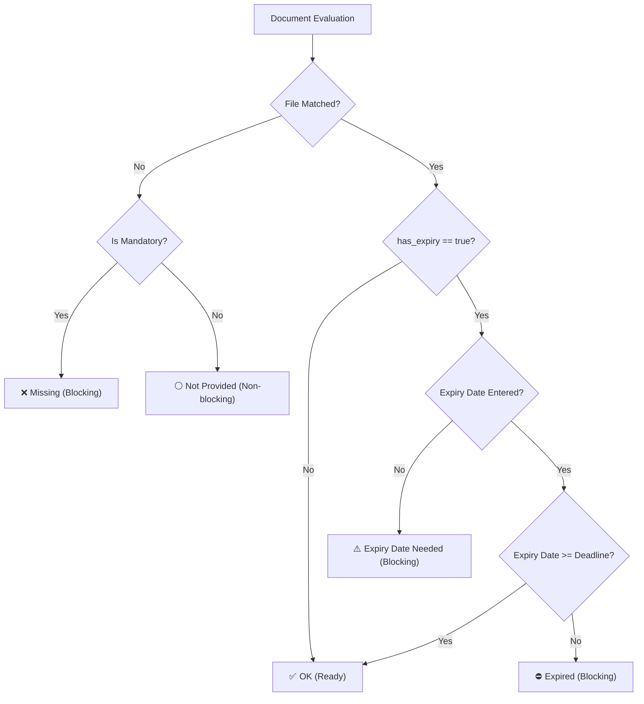

# TenderPack — Tender Document Package Builder

> **AI DevFest Hackathon** | Client-Side Tender Package Assembly & Verification Engine  
> Built for compliance with the **AI DevFest Problem Statement** (Tasks 4.1–4.9, Sections 5 & 6, and Section 7 Bonus Tasks).

---

## 📌 Executive Summary & Problem Context

When competing for public and enterprise procurement tenders, bidders must submit a rigorously compiled document package (Trade License, Tax/TIN clearance, VAT certificates, Bank Solvency letters, experience credentials, and technical/financial proposals). 

Manual preparation frequently results in rejected bids due to:
- Missing mandatory attachments
- Expired statutory licenses relative to the submission deadline
- Accidental duplicate files attached to separate requirements
- Incorrect document sequence or non-compliant pagination
- Missing continuous running page numbering (`Page X of Y`) and tender metadata

**TenderPack** is a zero-backend, client-side web application designed to run entirely in the browser. It guides office staff through importing tender requirements, uploading candidate PDFs, validating expiry and completeness in real-time, auto-matching files, stamping digital seals, and generating a single, production-ready, standardized PDF package.

---

## 🚀 Live Demo & Artifacts

- **Live Web Application**: [TenderPack on Vercel / GitHub Pages](https://ai-devfest-zenith.vercel.app/)
- **Sample Verified Package**: [`output/T-2026-0417_Package.pdf`](./output/T-2026-0417_Package.pdf)
- **Status Dashboard Verification**: [`screenshots/`](./screenshots/)

---

## ⚙️ Core Requirements Implementation Matrix (Section 4 & 5)

| Requirement | Spec Ref | Implementation Details |
|---|---|---|
| **Load Requirements** | Task 4.1 | Imports `requirements.json` via drag-and-drop or file selector. Displays tender metadata (ID, entity, bidder, deadline) and requirements table sorted by `order`. |
| **PDF Upload & Validation** | Task 4.2 | Batch multi-file drag-and-drop upload. Rejects non-PDF files with clear error dialogs. Calculates and displays real-time page count per PDF. |
| **Document Matching** | Task 4.3 | Interactive dropdown matching allowing exact 1-to-1 association. Matches can be modified or cleared at any time. |
| **Expiry Date Tracking** | Task 4.4 | Real-time date pickers for items with `has_expiry = true`. Calculates validity against the tender's `submission_deadline`. |
| **Real-time Status Engine** | Task 4.5 | Deterministic reactive evaluation of document readiness (Section 5 rules) with immediate badge updates. |
| **Content Duplicate Detection** | Task 4.6 | Uses binary content hashing (SHA-256) to identify duplicate files regardless of filename. Flags duplicates and blocks simultaneous matching to different requirements. |
| **Guarded Package Generation** | Task 4.7 | The **"Generate Package"** button is strictly locked whenever blocking issues exist, complete with an interactive blocker drawer/banner explaining why. |
| **Single-Click Package Export** | Task 4.8 | Assembles and downloads the compiled document package named `<tender_id>_Package.pdf` (e.g., `T-2026-0417_Package.pdf`). |
| **Bilingual Interface** | Task 4.9 | Seamless instant switching between **English (EN)** and **Bangla (BN)**, dynamically updating all UI text and document labels (`title_en` vs. `title_bn`). |

---

## 🚦 Status Engine Specification (Section 5)

Every required document displays exactly one of the following statuses based on strict logic:



| Status | Trigger Condition | Package Generation |
|---|---|:---:|
| **Missing** | Mandatory document (`mandatory = true`) with no file attached | **BLOCKS** |
| **Expiry date needed** | `has_expiry = true`, file matched, but no expiry date provided | **BLOCKS** |
| **Expired** | Expiry date is strictly before `submission_deadline` (`YYYY-MM-DD`) | **BLOCKS** |
| **Not provided** | Optional document (`mandatory = false`) with no file attached | **Allowed** |
| **OK** | File matched; and if `has_expiry = true`, expiry is on or after deadline | **Allowed** |

*Note: If a document expires on the exact day of the deadline, it is treated as **OK** according to Section 5.*

---

## 📄 PDF Assembly & Pagination Rules (Section 6)

The output PDF is assembled client-side using `pdf-lib`:

1. **Cover Page (Page 1 - English)**:
   - Official Tender ID, Tender Title, Procuring Entity, Bidder Organization.
   - Submission Deadline and Package Generation Timestamp.
   - Clean tabular manifest of all included documents in exact required numerical order.
2. **Table of Contents / Index (Bonus)**:
   - Dynamic page index identifying the exact start page of every merged document.
3. **Sequential Document Compilation**:
   - Merges candidate document pages preserving original resolution and order.
   - Gracefully skips unprovided optional documents without disrupting numbering.
4. **Running Headers & Footers**:
   - Universal continuous footer across all pages: `<tender_id> | Page X of Y`.
   - Placed with precision margins at the bottom of each page to prevent obscuring original document content.

---

## 🎁 Bonus Features Implemented (Section 7)

- [x] **Dynamic Table of Contents (TOC)**: Injects an index page immediately following the cover page displaying starting page numbers for each attachment.
- [x] **Seal & Signature Stamping**: Interactive modal allowing users to upload transparent corporate seals/signatures and apply them to target pages (`All Pages`, `Cover Only`, or `Custom Range`).
- [x] **Checklist Export (CSV)**: Export the complete tender audit log (document title, filename, page count, expiry date, status) for executive review.
- [x] **Project State Persistence**: Save current progress to local JSON project state file and restore it at any time, plus automatic `localStorage` caching.
- [x] **Intelligent Auto-Matching**: Fuzzy string matching algorithm that pairs uploaded PDF filenames (e.g. `trade_license_2026.pdf`) with tender items automatically.
- [x] **Corrupted / Protected PDF Guard**: Catches encrypted or corrupt PDFs gracefully on upload and alerts the user with descriptive diagnostics instead of crashing.
- [x] **Bangla Font Rendering**: Custom typography integration using Google Font *Hind Siliguri* for clean native Bengali presentation.

---

## 🔍 Sample Pack Hidden Issues & Resolution

During analysis of the provided `sample-pack.zip`, the following real-life traps were identified and addressed:

1. **Corrupted / Incomplete Files**: Non-standard or unreadable PDFs are flagged during the upload stage.
2. **Duplicate Files with Distinct Names**: Two files with identical cryptographic binary hashes are flagged with a `DUPLICATE` warning tag, preventing duplicate attachment to multiple requirements.
3. **Mismatched / Expired Licenses**: Outdated certificates failing the tender's deadline date are caught by the status engine before export.
4. **Missing Mandatory Documents**: Clear visual alerts indicate unfulfilled tender criteria.

---

## 🛠️ Technology Stack & Architecture

- **Core Framework**: [React 19](https://react.dev/) + [Vite](https://vitejs.dev/)
- **PDF Manipulation & Merging**: [`pdf-lib`](https://pdf-lib.js.org/) (runs 100% in-browser via WebAssembly / TypedArrays)
- **Styling & UI**: [Tailwind CSS](https://tailwindcss.com/) with dark/light mode toggle and custom responsive data tables
- **Icons**: [Lucide React](https://lucide.dev/)
- **Privacy & Security**: **Zero Server Uploads** — all document bytes stay strictly in the user's browser memory (no backend, no analytics tracking, no external data leakage).

---

## 💻 Local Development & Build

### Prerequisites
- Node.js (v18 or higher recommended)
- npm or yarn

### Setup Instructions

1. **Clone the repository**:
   ```bash
   git clone https://github.com/ZenithRahman/ai-devfest.git
   cd ai-devfest
   ```

2. **Install dependencies**:
   ```bash
   npm install
   ```

3. **Run local development server**:
   ```bash
   npm run dev
   ```
   Open `http://localhost:5173` in Google Chrome.

4. **Build production bundle**:
   ```bash
   npm run build
   ```

5. **Preview production build**:
   ```bash
   npm run preview
   ```
